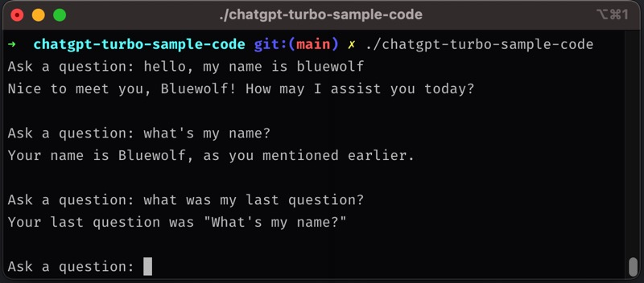

# chatgpt-turbo-sample-code

This is a simple code sample demonstrating the use of OpenAI's new model "gpt-3.5-turbo" with the Go programming language. The project allows for the storage of a user's previous conversations, enabling sustainable dialogue.  



## Requirements

To use this project, you will need to obtain an API key from the OpenAI website. Replace the placeholder text `YOUR_API_KEY` with your own key in the following line of code in `main.go`:

```go
apiKey := "YOUR_API_KEY"
```


## Usage

To use this project, follow these steps:
1. Obtain an API key from the OpenAI website.
2. Replace `YOUR_API_KEY` in `main.go` with your API key.
3. Run `make` in your terminal to build the project.
4. Run `./chatgpt-turbo-sample-code` to start the program.
## Features

This project demonstrates the following features:
- The use of OpenAI's "gpt-3.5-turbo" model.
- The ability to save a user's previous conversations.
- Sustainable dialogue through the use of previous conversations.
## Contributing

If you would like to contribute to this project, feel free to fork it and create a pull request. Any contributions are welcome.
## License

This project is licensed under the MIT License. See the [LICENSE](https://chat.openai.com/LICENSE)  file for details.